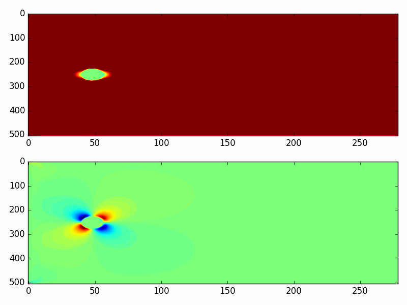
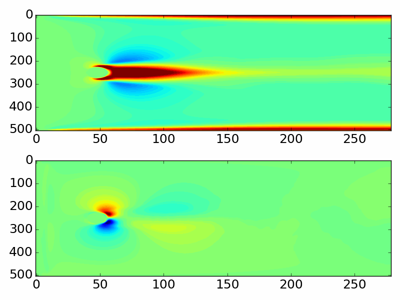
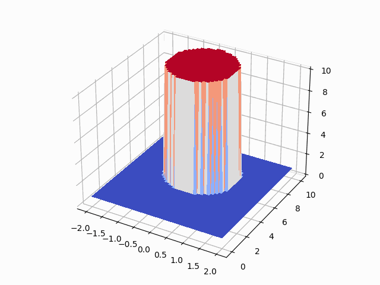
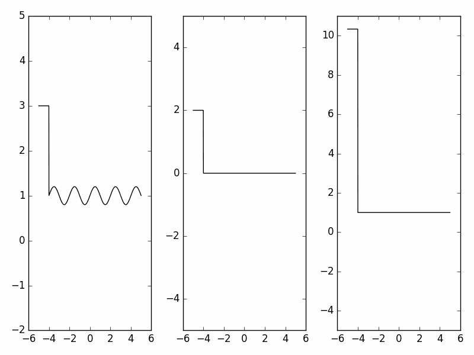
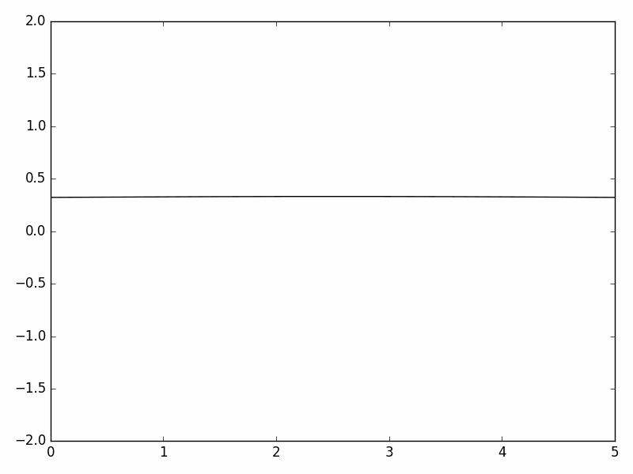

# POD for Accelerated NODE

 
## About

Project advances machine learning techniques for data driven approaches to complex dynamical systems from data. In particular, this project combines proper orthogonal decomposition (POD), with Heavy-Ball accelerated neural ODEs (HB-NODE) to significantly improve model efficiency and accuracy for complex dynamics. Furthermore, this project demonstrates robustness of HB-NODE to variabile initializations of the underlying dynamical systems.

We consider 4 primary types of experiments. A VAE model for predicting steady-state dynamics. A SEQ model for predicting steady-state dynamics from transient dynamics. And finally a PARAM model for training on several varrying parameterizations and predicting unseen parameterizations.

Our submitted work can be found on arXiv: [https://arxiv.org/abs/2202.12373](https://arxiv.org/abs/2202.12373)


Notes: after refactor and rebase, models parameters are currently unoptimized. A suggested parameter list can be found in `./bin/tuning.txt`. Results will follow after rebase&refactor.

[commet]: <> (TODO: Update the above repo size at launch to exclude output and data directores. Current estimated size ~100 MB)

## Installation
To ensure all necessary packages are installed consider running the following command. This will not update or adjust the version of any currently installed packages.
```bash
pip install -e .
```

## Datasets

All datasets can be generated by runinng the following
```bash
sh ./bin/data_generator.sh python3
```

## Executing Examples

All examples can be found in `./bin/*_examples.sh`.
All examples can be run using 

```bash
sh ./bin/experiments.sh python3
```
``

## Results

### Von-Karman street flow





### Kolmogorov-Petrovsky-Piskunov equations



### Euler Equations



### Fiber


